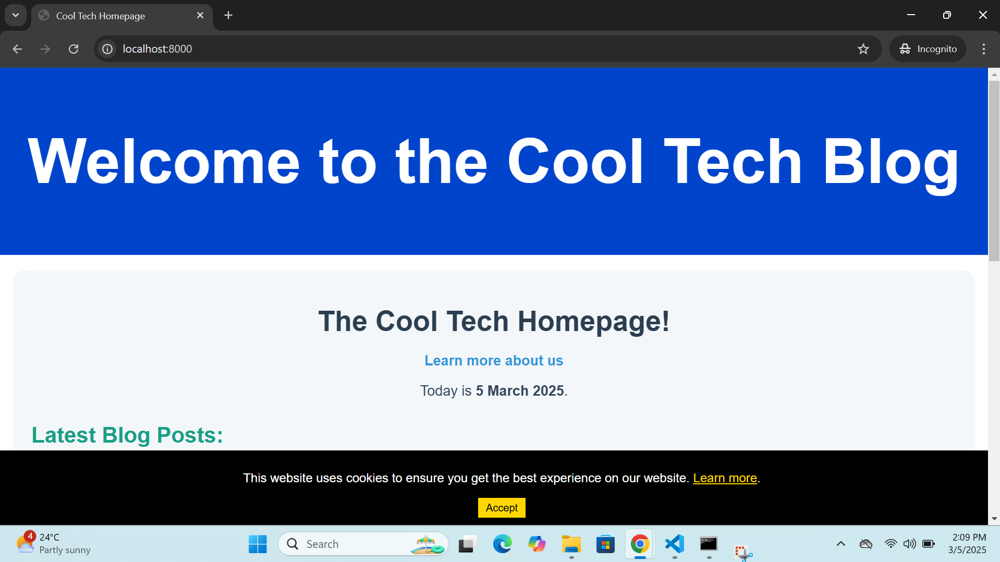

<<<<<<< HEAD
# Cool Tech Blog - Laravel Application

## Description

This is a Laravel-based blog platform for "Cool Tech" that shows articles, categories, tags, search functionality, and legal pages. The application includes routing, controllers, and views for displaying articles, greeting users, handling legal pages, and more.

## Features

- **Home Page**: Displays the homepage.

- **About Page**: Simple page displaying information about the platform.

- **Article Pages**: Displays individual articles with dynamic content.

- **Category Pages**: Shows posts within a particular category.

- **Tag Pages**: Displays posts associated with specific tags.

- **Search Functionality**: Includes a search page and results page.

- **Legal Pages**: Terms of Service and Privacy Policy.

## Installation

Follow these steps to set up the project:

1. **Clone the repository**:
    git clone https://github.com/Ash2790/cool_tech_blog.git
    cd cool-tech-blog
   

2. **Install dependencies**:
    composer install
    npm install

3. **Copy the example environment file and configure it**:
    cp .env.example .env

4. **Generate an application **key:
    php artisan key:generate

5. **Load the provided database dump**:
    Please make use of the database dump which is provided in the project folder marked database_dump and the file name is updatedcool_tech.sql.
    Please load this into your database. Make sure your database is running and configured correctly in your [.env]file. Then, run the following command to import the dump:
    mysql -u your_username -p your_database_name < path/to/cooltechdump.sql

6. **Fix the `ServeCommand.php` file**:
    The `ServeCommand.php` file needs to be fixed to handle a specific date format issue that causes an `Undefined array key 1` error. This error occurs because the date format in the server output does not match the expected format. To fix this, open the `ServeCommand.php` file located in the file path: vendor\laravel\framework\src\Illuminate\Foundation\Console\ServeCommand.php and update the `getDateFromLine` method as follows:

   protected function getDateFromLine($line)
{
    $regex = '/^\[([a-zA-Z]{3} [a-zA-Z]{3} \d{1,2} \d{2}:\d{2}:\d{2} \d{4})\]/';

    $line = str_replace('  ', ' ', $line);

    preg_match($regex, $line, $matches);

    if (!isset($matches[1])) {
        throw new \Exception("Date not found in line: $line");
    }

    return Carbon::createFromFormat('D M j H:i:s Y', $matches[1]);
}
*** Make sure to save the changes in the editor.

7. **Start the development server**:
    php artisan serve

8. **Visit the application**:
    Open your browser and go to `http://localhost:8000`.

## Troubleshooting

If you encounter any issues during the installation, please check the following:

- Ensure your database is running and the credentials are correct.
- Review the Laravel documentation for any additional setup steps.
- Make sure to **Fix the `ServeCommand.php` file** as this is essential for the date and time to pull through in the correct format. (Please see bullet point number 6 in Readme file).

## Additional Notes

- Make sure to run the installation steps yourself to verify that everything works as expected.
- If you make any changes to the installation process, update this README accordingly.

## Routes

The following routes are available in the application:

- **Home Page**: GET /
  Displays the homepage with a welcome message.

- **About Page**: GET /about
  Displays information about the platform.

- **Article Detail Page**: GET /article/{id}
  Displays a specific article based on its ID.

- **Greeting Page**: GET /greeting/{name}
  Displays a personalized greeting with the provided name.

- **Legal Pages**: GET /legal/{subsection}
  Displays legal pages (Terms of Service (tos) or Privacy Policy).

- **Category Page**: GET /category/{slug}
  Displays posts related to a specific category based on the slug.

- **Tag Page**: GET /tag/{slug}
  Displays posts associated with a particular tag.

- **Search Page**: GET /search
  Displays a search page where users can enter search terms.

- **Search Results Page**: GET /search/results
  Displays search results based on the user's query.

## Controllers

The following controllers are responsible for handling the logic of different routes:

- **HomeController**:
  Handles the homepage and any initial data required for it.

- **ArticleController**:
  Handles displaying individual article pages.

- **CategoryController**:
  Handles displaying articles by category.

- **TagController**:
  Handles displaying articles associated with tags.

- **SearchController**:
  Handles the search functionality. It includes methods to display the search page and show the results based on the query.

- **Legal Pages**:
  A simple route closure handles the legal pages, which include Terms of Service and Privacy Policy.

## Views

The following views are used to display content to the users:

- **Home View**: Displays the homepage content.
- **About View**: Displays the about page content.
- **Article View**: Displays the article content with details like the title, date, tags, and category.
- **Legal View**: Displays the legal pages for Terms of Service and Privacy Policy.
- **Search View**: Displays a form to search for articles or content.

## Example of Article View

The article page (`article.blade.php`) displays the following content:

- Title of the article
- Publication date
- Category ID
- Article content
- Tags associated with the article (if available)

## License

This project is open-source courtesy of Ashford R. Gougoh.

=======
# cool_tech_blog
>>>>>>> f5419f8fb30622c1d699e3fcc0d3906a3631f8ab
